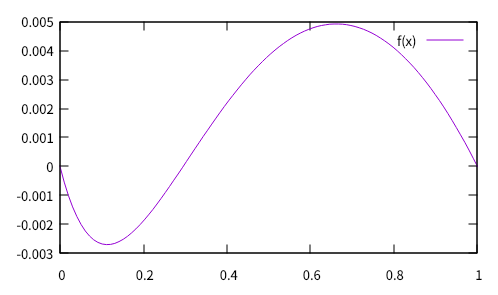

# 2. 対数関数の分解公式

　対数について示そう．ここでは「対数関数」としているが，本来，対数とは「ある数の対とする数」をいうため，文献でこの呼び方は不適切である．しかし初等関数論であるため，関数として扱う．   

　前章で述べた「真数の逆元」は，本来ならば複素解析学で扱われようものであるが，定義域も値域も実数解であるといった特殊解である．最も，代数方程式で好まれそうな宇宙定数が変数として現れるようなものであり，自然数というよりも二進指数のほうに微分積分学が基礎にある．  
　これが真値であったかのように，真数の逆元を変数で現わそうものなら  

$$\frac{2^x}{2}-x\quad\text{But}, 1 \leq x \leq 2$$

　として，二進で帰着してしまう．  
　そもそも，分解公式は，変数xを相補するものとして対数の根を現す「対数累乗積分 *logarithmic power integral*」から発見された．これは「真数の逆元の対数」と呼ぶことができるだろう．しかしながら，興味深いことに，現わされた主値には，元となる逆元には累乗根がなく，対数のほうには累乗根がうっすらと現れている．  

　この定義は  

$$\log_2(\left\lfloor 1 \right\rfloor)=0$$

　この積分を変数に現そうならば  
 
$$\log_2(1+x)-x\quad \text{But}\, 0 \leq x \leq 1$$
 
　として確認できる．  

　“逆元の対数”より正規化した累乗根 $\sqrt{1+3x}-1$ を差し引くことを考えると，以下の式を得る．  

$$\log_2(1+x) - (\sqrt{1+3x}-1)\quad \text{But}\, 0 \leq x \leq 1$$

　gnuplotでプロットすると，以下を得られる．  

```gnuplot
log2(x) = log(x)/log(2)
f(x) = log2(1+x)-(sqrt(1+3*x)-1)
plot [0:1] f(x)
```



　これにより，対数累乗積分の根は-3であることが分かっている．この解は0を連続しないため，累乗根を積分に持つことが分かる．対数の根は積分によるのだろう．  
　逆元の主値は実数全体で一価な負の値であり，対数逆元の主値は実数全体で一価な正の値である．特性とも言えるこれはL.オイラー *l. euler* のガンマ積分 *gamma integral* に類似した特徴がある．また，各々主値をフォーカスしてプロットしてみると，三角関数 *trigonometric function* で見受けるような相対性を確認できる．  
　gluplotで以下をタイプしプロットしてみる．

```gnuplot
set grid
set size ratio -1
log2(x) = log(x)/log(2)
linvelem(x) = log2(1+x)-x
invelem(x) = 2**x/2-x
plot [-2:4] [-4:4] invelem(x), linvelem(x)
```

　以下を得られる．  


　以下は変数の単射性をパラメトリック曲線で示したものである．高次 *high powered* な多価関数 *multi-valued function* であるためか，リーマン・ゼータ関数 *riemann zeta function* のクリティカル・ライン *critical line* で確認できるような(，かつシンプルな)パラメトリック曲線を持つことが分かる．  

```gnuplot
set parametric
set size ratio -1
set trange [-1:3]
log2(x) = log(x)/log(2)
linvelem(x) = log2(1+x)-x
invelem(x) = 2**x/2-x
plot invelem(t),linvelem(t)
```


　多価関数の話題は指数には変数の現れとして散見されようにも，スフィア *sphere* がないため，さも外野の意見のようになってしまう．今ひとつ確認できなかったため，そこに変数はないと思われるが，もしあったとしても収束せずに発散するだろう．一方で対数では話題としててんこ盛り状態で，解析関数としても議論を持つようになる．  
　ちなみに複素解析にまで拡張すると，このプロットはリボンのようになり，“裾”を横に広げるようになる．とはいえ，実数根が1であるという証明にはなるだけで，他に興味深い成果は得られていない．  

　ここで多価関数は，概ね指数分解に従う $x$ をいうのであれば，

$$\text{EDF}^\prime(X)\subseteq (ab)$$

　こう定義できる．ここで $a$ は指数分解に従う $x$ ， $b$ はその補数である．  

　累乗根にある $x$ が指数分解に遭うときには，それは $x$ の値に応じている．これを相補 *complement* という．これは累乗根が $x$ の母関数 *generating function* であるようなべき級数 *power series* である．指数分解公式の主要根 *primary roots* でありながら，概ね対数関数に現れる．  
　この関数は，対数であれば $\log^\prime(x)$ ，指数であれば $\exp^\prime(x)$ と定義できるだろう．また $b$ は、対数では $x$ の相補と等しくなる．  

　相補は分解能を手続きに総和を収束方向とする．こうした振る舞いは指数関数にもあるが，指数関数では総乗を収束方向とするところに違いがある．分解能は指数こそ加算されるものの仮数は数が同じであれば全て等しいという特徴がある．  
　ここで基数10を考えよう． $x$ の相補である指数分解が基数を10とすれば，それは分解能は十進に遭う．すると整数・少数と数を等しくするならば，その $x$ の仮数は全て等しい．  

$$\log_{10}(1.1111) \approx 0.045753147594141\ldots$$
$$\log_{10}(11.111) \approx 1.045753147594141\ldots$$
$$\log_{10}(111.11) \approx 2.045753147594141\ldots$$
$$\log_{10}(1111.1) \approx 3.045753147594141\ldots$$
$$\log_{10}(11111)  \approx 4.045753147594141\ldots$$

　ということは，分解能に従うどのような $x$ にも指数・仮数は常に一定なのである．0への収束を分解能に置くと， $x$ の逆数は  

$$\log_{10}(1/11111)  \approx -4.045753147594141\ldots$$
$$\log_{10}(1/1111.1) \approx -3.045753147594141\ldots$$
$$\log_{10}(1/111.11) \approx -2.045753147594141\ldots$$
$$\log_{10}(1/11.111) \approx -1.045753147594141\ldots$$
$$\log_{10}(1/1.1111) \approx -0.045753147594141\ldots$$

　整数に符号を与えるものの，相補を保っていることが分かる．  

　逆元定理からすると，この相補は本来奇関数 *odd function* であろう．  
　この方程式は  

$$\log^{\prime}(x)\subseteq (ab)= \log_b(\frac{1}{a})+\log_b(a)=0$$

　に満足し，すると $x$ は恒等式 *identity* にあるのだから，移項すると  

$$\log(x)=-\log(\frac{1}{x})$$

　が成り立つ．相補はいたるところで収束する．もし値域 *range number* を数値計算で条件数 *conditional number*  に満足させることを考えるなら，解析接続 *analytic continuation* する幅はぐんと広がることになる．  

　指数分解公式の方程式は“n次連立方程式”であることに注目したい．通常，物理学として方程式が連立する場合，連立n次方程式という．これはn次な方程式が連立しているためである．ところが指数分解に従う方程式は連立方程式自体がファクタである．そのため次数としてこれをファクタに持つため，n次な連立方程式となる．  
　変数としてはとても自明であり，特徴というよりも，はっきりしている．  
　例をGnuplotに示そう．  

```Gnuplot
mod(x, p) = x - p * floor(x / p)
log2(x) = log(x)/log(2)
f(x) = mod(log2(x), 1)
plot [0:5] f(x)
```

　結果を以下に．ちなみに基数相補法だともっと説得力のある模様が得られる．C言語なら`frexp()`でもよい．  


　ここでは本題から外れているため触れないが，解析接続したら，興味深い話題が尽きないほど出てきそうである．  
　Wolfram|Alphaに診断してもらうと，以下のような解析結果を得られる．  

[log2(x) mod 1](https://ja.wolframalpha.com/input?i=log2%28x%29+mod+1)

　複素解析を以下に．複素平面における剰余類まで見えてきそうなほど幾何学な模様である．  

[3dplot log2(x+iy) mod 1](https://ja.wolframalpha.com/input?i=3dplot+log2%28x%2Biy%29+mod+1)

　これを考えると，恐らくこの公式にも素数が隠れているだろう．ガンマ関数にも素数が $\ln(p!) = \ln((p-1)!) + \ln(p), p  \notin \mathbb{P}$ のように隠れているほどだ．以下 $\log\prime\prime(x) \subseteq (ab)$ のような関数に違いない．  


(執筆中)  
